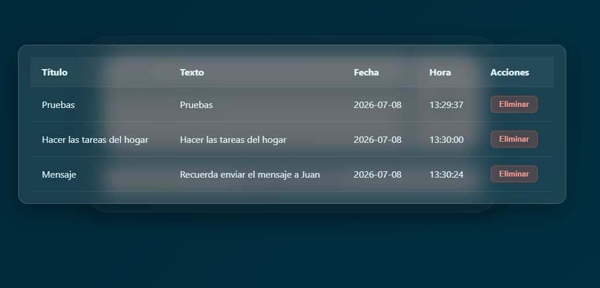

# 📝 Apuntador

## 📌 Descripción
Aplicación web para registrar anotaciones (CRUD) y visualizarlas de forma estructurada en una tabla simple. Toda la información se guarda de forma persistente en una base de datos.

## 🛠️ Tecnologías usadas

    

## 🖼️ Imágenes y gif de demostración

Aquí puedes ver una vista previa del diseño principal y el funcionamiento de la demostración.

### Imagen principal para apuntar las cosas

### Tabla para mostrar lo apuntado

## 🚀 Cómo ejecutarlo

Para levantar este proyecto en tu entorno local, sigue estos pasos:

1. **Prepara el servidor:** Coloca la carpeta del proyecto dentro del directorio raíz de tu servidor local (por ejemplo, en la carpeta `www` si usas WAMP).
2. **Base de datos:** Crea una nueva base de datos en tu gestor local (ej. phpMyAdmin). *(Nota: Si tienes un archivo .sql con la estructura, impórtalo aquí)*.
3. **Conexión:** Abre el archivo de configuración correspondiente en el código y añade los datos de conexión (nombre de la base de datos, usuario y contraseña).
4. **Ejecución:** Abre tu navegador web y accede a través de `http://localhost/Proyectos-pequeños/apuntador`.