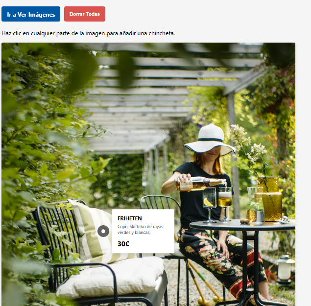
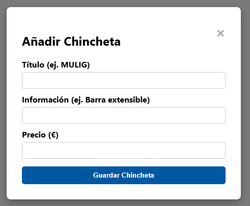
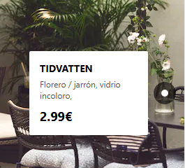

# 🛋️ Ikea-Imagenes

## 📌 Descripción
Componente interactivo inspirado en el catálogo visual de IKEA. Este proyecto permite hacer clic en cualquier parte de una imagen para crear "chinchetas" o puntos interactivos *(hotspots)* para luego poder redirigir al producto. Al crearlos, se despliega un formulario para añadir información del producto (título, descripción y precio).

Las chinchetas y la vista de las mismas nunca salen de las imágenes, por lo que se adaptan a cualquier imagen y lugar de la página, da igual dónde estén colocadas. Los datos y las coordenadas exactas de cada punto se guardan de forma persistente en el almacenamiento local del navegador (`localStorage`), por lo que las etiquetas se mantienen fijas en su sitio incluso si recargas la página.

## 🛠️ Tecnologías usadas

## 🖼️ Imágenes y gif de demostración

Aquí puedes ver una vista previa del diseño y cómo funciona la creación de chinchetas sobre la imagen.

### Imagen principal donde se muestra un botón para ver las imágenes, un botón rojo para borrar todas las chinchetas y la chincheta con el modal

### Modal para añadir un nuevo punto de información y chincheta junto a la información
   

## 🚀 Cómo ejecutarlo

Este proyecto no requiere servidor local (como WAMP) ni bases de datos, ya que funciona íntegramente del lado del cliente. Toda la información de los pines se guarda directamente en la caché/memoria de tu navegador.

Para visualizarlo y probarlo, simplemente sigue estos pasos:

1. Clona o descarga este repositorio en tu ordenador.
2. Abre la carpeta del proyecto.
3. Haz doble clic en el archivo `index.html` para abrirlo directamente en tu navegador web.
4. *(Nota)*: Haz clic en cualquier parte de la imagen para probar la creación de una nueva chincheta.
