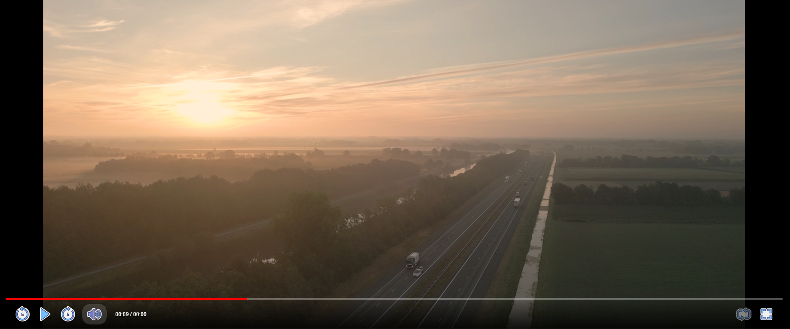
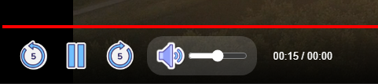
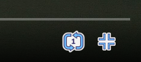

# 🎬 Interfaz de Vídeo Personalizada

## 📌 Descripción
Diseño e implementación de un reproductor de vídeo HTML5 con una interfaz de usuario (UI) totalmente a medida. Este proyecto reemplaza los controles nativos del navegador por un panel de control estético y altamente funcional.

Cuenta con una línea de tiempo interactiva (con *tooltip* de tiempo al pasar el ratón), controles dinámicos que cambian de estado y un sistema de inactividad que oculta la interfaz automáticamente si el usuario deja de mover el ratón tras unos segundos.

## 🖼️ Imágenes de demostración y funciones

Aquí puedes ver una vista previa de la interfaz terminada y el detalle de cada bloque de controles.

### Interfaz Principal
Vista general del reproductor ocupando el ancho asignado, con la barra de progreso inferior personalizada.

### Controles de Reproducción y Volumen
En la parte izquierda de la barra de controles se agrupan las funciones principales de reproducción y sonido.
*   **Reproducción y saltos:** Botones para pausar/reanudar y para retroceder o avanzar la reproducción exactamente en bloques de 5 segundos.
*   **Audio y Tiempo:** Un control de volumen inteligente cuyo icono cambia según la intensidad, un deslizador para ajustarlo y el contador dinámico del tiempo actual frente al total del vídeo.

### Controles de Repetición y Pantalla Completa
En la parte derecha de la barra se ubican los ajustes de visualización.
*   **Bucle (Repeat):** Permite alternar entre reproducción normal, repetición general o forzar el bucle infinito del vídeo actual (estado *Repeat 1*).
*   **Expansión:** Botón para alternar entre el tamaño estándar y el modo de pantalla completa nativo del navegador.

## 🛠️ Tecnologías usadas

## 🚀 Cómo ejecutarlo

Este proyecto no requiere servidor local ni bases de datos, ya que la manipulación del vídeo se hace a través del DOM en el lado del cliente.

Para visualizarlo, simplemente sigue estos pasos:

1. Clona o descarga este repositorio en tu ordenador.
2. Asegúrate de tener un archivo de vídeo llamado `video.mp4` en la misma carpeta del proyecto para que el reproductor pueda cargarlo.
3. Haz doble clic en el archivo `index.html` para abrirlo directamente en tu navegador web.