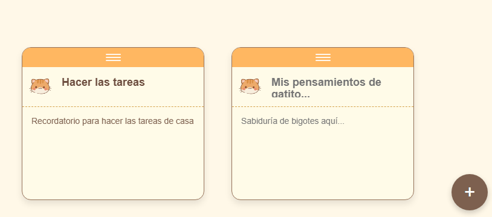
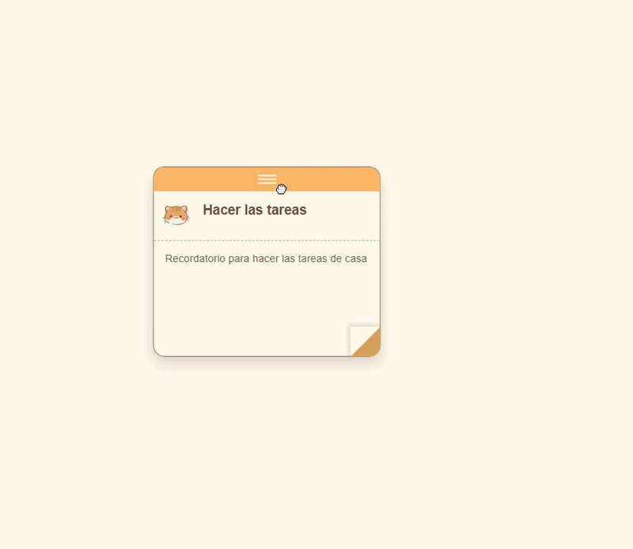
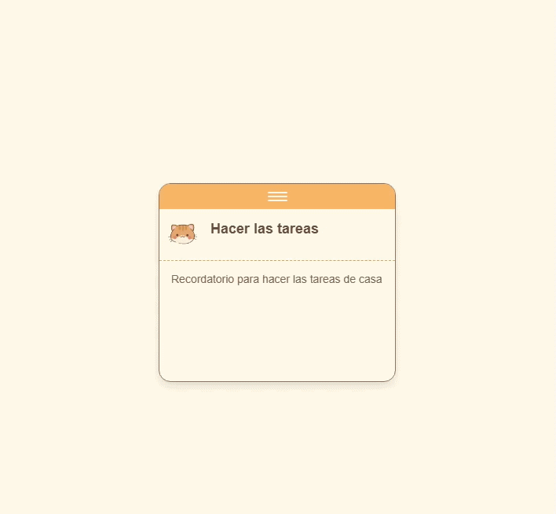

# 🐱 Notas-Arrastrables

## 📌 Descripción
Página interactiva donde se crean notas arrastrables (*drag and drop*) inspiradas en un diseño tipo gatitos. La idea es tener unas notas sencillas y fáciles de crear. Al no usar base de datos, la persistencia es mínima y todo se gestiona directamente desde el almacenamiento local del navegador (caché/Local Storage).

## 🛠️ Tecnologías usadas

  

## 🖼️ Imágenes y gif de demostración

Aquí puedes ver una vista previa del diseño principal y el funcionamiento de la demostración.

### Imagen principal y boton de crear nota vacia

### Funcionamiento de arrastre y eliminacion de la nota
 

## 🚀 Cómo ejecutarlo

Este proyecto no requiere servidor local (como WAMP) ni bases de datos, ya que funciona íntegramente del lado del cliente. 

Para visualizarlo, simplemente sigue estos pasos:

1. Clona o descarga este repositorio en tu ordenador.
2. Abre la carpeta del proyecto.
3. Haz doble clic en el archivo `index.html` para abrirlo directamente en tu navegador web.